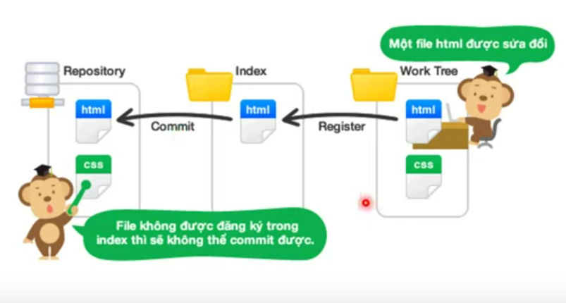
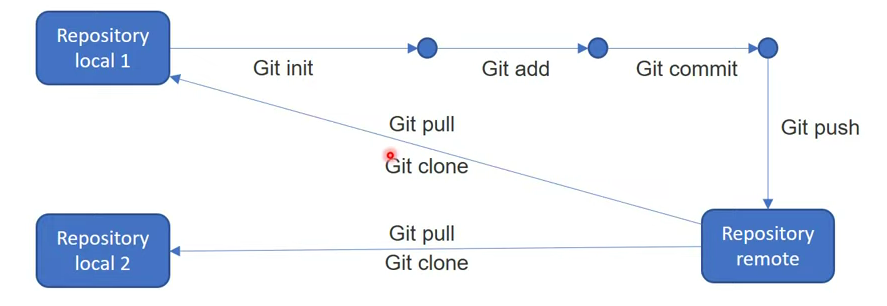
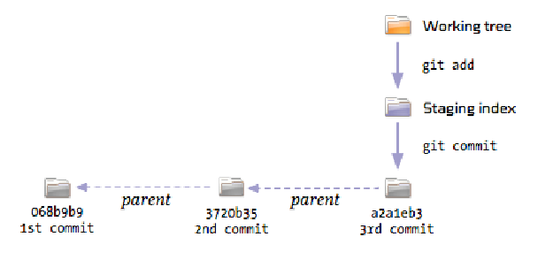

#What is Git?
Git is a free and open source distributed version control system designed to handle everything from small to very large projects with speed and efficiency

#Some basic concepts

##Remote Area
In Git, "remote" refers to a repository that is different from the repository you are currently working on. The remote repository can be located on the same machine or any other remote server on the Internet. Remote repositories are typically used to share code with others in your team, or to synchronize code between different machines that you use.

##Staged(cached) area/ Index
In Git, "staged area" and "cached area" are two terms commonly used to describe the same concept. In Git, this concept is called "index", which allows users to configure which changes to commit from their working directory.

In other words, "staged area" or "cached area" is the area between the ***working directory*** and ***the repository*** where changes can be selected to be committed. When you run the git add command, the selected changes will be added to the staged area or cached area. When you run the git commit command, the staged changes will be permanently stored in the repository.

##Local
*Local* in Git is often used to refer to the local, temporary, and on-machine repository of the user. The local repository is a local copy of the repository from the central storage, typically used for development and testing of new features before pushing them to the main repository.

The local repository contains the files and information about the history of your source code and is stored on your computer.

#Git Commands
- git init
- git add 
  > git add origin master <'url'>
  > git add <file_name>
- git push
  > git push origin <branch_name>
- git pull
  > git pull origin <branch_name>
- git branch
  >print out branch in project
  > git branch <branch_name> : create new branch
- git checkout
  >git checkout <branch_name> :
- git merge
  >git merge <branch_name>
- git log
- git status
- git stash
- git configuration commands
  > git config --global <user.name>
  > git config --global <user.emai> 

#Process
- Edit the file content located in the working tree.
- Stage modifications made to the index by git add command.
- Commit index content with git commit command.

